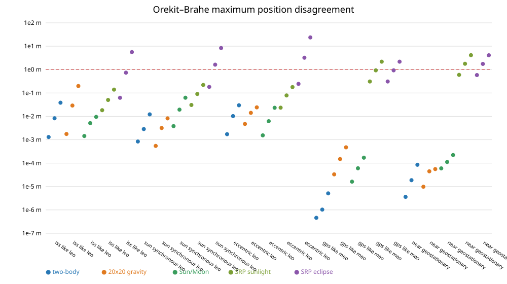

# Dynamics cross-validation report

Candidate: Brahe 1.7; reference: Orekit 13.1.7. States are compared in GCRF.
Acceptance: <=1 m for gravitational profiles, <=5 m for continuous SRP, and <=25 m for conical SRP across eclipse boundaries: **PASS**.
The SRP thresholds are explicit: small ephemeris/radiation-direction differences accumulate to ~4.1 m at GEO, while different limb/event implementations accumulate up to ~20 m over seven days near equinox. Both remain investigation items.

| Scenario | Model | Horizon | Final position | Max position | Final velocity | R / T / N final |
|---|---:|---:|---:|---:|---:|---:|
| iss_like_leo | two_body | 1 d | 0.00130875 m | 0.00130875 m | 1.48174e-06 m/s | -1.533e-05 / 0.001309 / -6e-09 m |
| iss_like_leo | two_body | 3 d | 0.00830975 m | 0.00830975 m | 9.40069e-06 m/s | -3.582e-05 / 0.00831 / -3.595e-08 m |
| iss_like_leo | two_body | 7 d | 0.0384812 m | 0.0384812 m | 4.35381e-05 m/s | -7.425e-05 / 0.03848 / 1.758e-08 m |
| iss_like_leo | gravity | 1 d | 0.00176552 m | 0.00176552 m | 1.96188e-06 m/s | -3.93e-05 / 0.001712 / 0.0004295 m |
| iss_like_leo | gravity | 3 d | 0.0290304 m | 0.0290304 m | 3.29003e-05 m/s | -0.000144 / 0.02903 / 0.0002598 m |
| iss_like_leo | gravity | 7 d | 0.198994 m | 0.198994 m | 0.000225395 m/s | -0.0004735 / 0.199 / -0.0004735 m |
| iss_like_leo | third_body | 1 d | 0.00144687 m | 0.00144687 m | 1.637e-06 m/s | -1.166e-05 / 0.001447 / 1.337e-07 m |
| iss_like_leo | third_body | 3 d | 0.00513202 m | 0.00513202 m | 5.80583e-06 m/s | -1.236e-05 / 0.005132 / 3.792e-07 m |
| iss_like_leo | third_body | 7 d | 0.00948343 m | 0.00948343 m | 1.07297e-05 m/s | -1.19e-05 / 0.009483 / -1.301e-07 m |
| iss_like_leo | srp_sunlight | 1 d | 0.0100449 m | 0.0183208 m | 9.83154e-06 m/s | 0.008433 / -0.005456 / -6.537e-05 m |
| iss_like_leo | srp_sunlight | 3 d | 0.0446793 m | 0.0502427 m | 2.5234e-05 m/s | 0.01234 / -0.04294 / -5.013e-05 m |
| iss_like_leo | srp_sunlight | 7 d | 0.0795134 m | 0.138963 m | 6.36823e-05 m/s | -0.05112 / -0.0609 / -6.62e-06 m |
| iss_like_leo | srp | 1 d | 0.0149049 m | 0.0624198 m | 4.25141e-06 m/s | -0.0001724 / -0.0149 / 0.0002885 m |
| iss_like_leo | srp | 3 d | 0.737689 m | 0.737689 m | 0.000788635 m/s | -0.03436 / -0.7369 / 0.002422 m |
| iss_like_leo | srp | 7 d | 5.35923 m | 5.59458 m | 0.00614728 m/s | -0.0941 / -5.358 / 0.003955 m |
| sun_synchronous_leo | two_body | 1 d | 0.000842581 m | 0.000842581 m | 8.92827e-07 m/s | -9.856e-06 / 0.0008425 / 1.74e-08 m |
| sun_synchronous_leo | two_body | 3 d | 0.00286483 m | 0.00286483 m | 3.0363e-06 m/s | -1.254e-05 / 0.002865 / -1.926e-08 m |
| sun_synchronous_leo | two_body | 7 d | 0.0121671 m | 0.0121671 m | 1.29104e-05 m/s | -9.574e-07 / 0.01217 / 2.921e-08 m |
| sun_synchronous_leo | gravity | 1 d | 0.000298811 m | 0.000544152 m | 6.31026e-07 m/s | -9.417e-07 / 0.0002812 / 0.0001012 m |
| sun_synchronous_leo | gravity | 3 d | 0.00274839 m | 0.00317127 m | 3.29591e-06 m/s | -7.731e-06 / 0.002433 / -0.001279 m |
| sun_synchronous_leo | gravity | 7 d | 0.00797071 m | 0.00818715 m | 8.38006e-06 m/s | -2.288e-05 / 0.007569 / -0.0025 m |
| sun_synchronous_leo | third_body | 1 d | 0.00381947 m | 0.00381947 m | 4.04576e-06 m/s | -5.249e-05 / 0.003819 / 1.321e-07 m |
| sun_synchronous_leo | third_body | 3 d | 0.0194146 m | 0.0194146 m | 2.05837e-05 m/s | -8.262e-05 / 0.01941 / 3.45e-07 m |
| sun_synchronous_leo | third_body | 7 d | 0.0625768 m | 0.0625768 m | 6.6403e-05 m/s | -5.876e-05 / 0.06258 / -1.453e-06 m |
| sun_synchronous_leo | srp_sunlight | 1 d | 0.00707464 m | 0.0306456 m | 1.27987e-05 m/s | -0.004822 / 0.005175 / -0.0001171 m |
| sun_synchronous_leo | srp_sunlight | 3 d | 0.0606982 m | 0.0906259 m | 6.26566e-05 m/s | -0.02235 / 0.05643 / -8.99e-05 m |
| sun_synchronous_leo | srp_sunlight | 7 d | 0.219681 m | 0.220108 m | 0.000186672 m/s | 0.02309 / 0.2185 / 2.092e-05 m |
| sun_synchronous_leo | srp | 1 d | 0.18281 m | 0.18281 m | 0.000180425 m/s | -0.01446 / -0.1822 / 0.004308 m |
| sun_synchronous_leo | srp | 3 d | 1.55141 m | 1.6236 m | 0.00166892 m/s | -0.05284 / -1.55 / 0.01656 m |
| sun_synchronous_leo | srp | 7 d | 7.94468 m | 8.3657 m | 0.0085499 m/s | 0.1204 / -7.944 / -0.02473 m |
| eccentric_leo | two_body | 1 d | 0.00147754 m | 0.00172745 m | 1.29981e-06 m/s | -2.076e-05 / 0.001477 / 6.351e-09 m |
| eccentric_leo | two_body | 3 d | 0.00984812 m | 0.0102637 m | 9.84834e-06 m/s | 0.001139 / 0.009782 / 2.232e-08 m |
| eccentric_leo | two_body | 7 d | 0.025161 m | 0.029836 m | 2.28588e-05 m/s | -0.002484 / 0.02504 / -7.177e-09 m |
| eccentric_leo | gravity | 1 d | 0.00438821 m | 0.00473854 m | 3.75442e-06 m/s | 3.281e-05 / 0.004383 / -0.0002128 m |
| eccentric_leo | gravity | 3 d | 0.0138378 m | 0.0141125 m | 1.39882e-05 m/s | 0.001225 / 0.01368 / 0.001693 m |
| eccentric_leo | gravity | 7 d | 0.0216205 m | 0.0242777 m | 1.89022e-05 m/s | -0.001448 / 0.02141 / -0.002666 m |
| eccentric_leo | third_body | 1 d | 0.00129675 m | 0.0015392 m | 1.13977e-06 m/s | -6.369e-06 / 0.001297 / 6.116e-08 m |
| eccentric_leo | third_body | 3 d | 0.00592162 m | 0.00621924 m | 5.92285e-06 m/s | 0.0006851 / 0.005882 / -3.585e-07 m |
| eccentric_leo | third_body | 7 d | 0.0197052 m | 0.0232728 m | 1.79063e-05 m/s | -0.001938 / 0.01961 / 2.035e-06 m |
| eccentric_leo | srp_sunlight | 1 d | 0.0172148 m | 0.0235921 m | 1.24166e-05 m/s | 0.009134 / 0.01459 / -5.861e-05 m |
| eccentric_leo | srp_sunlight | 3 d | 0.0783045 m | 0.0783045 m | 5.19267e-05 m/s | -0.004685 / 0.07812 / -0.002536 m |
| eccentric_leo | srp_sunlight | 7 d | 0.0578009 m | 0.17913 m | 4.70231e-05 m/s | 0.04814 / -0.03163 / 0.004773 m |
| eccentric_leo | srp | 1 d | 0.178245 m | 0.244984 m | 0.000166047 m/s | -0.00348 / 0.1776 / 0.01506 m |
| eccentric_leo | srp | 3 d | 3.21175 m | 3.22527 m | 0.00322055 m/s | 0.4033 / 3.186 / -0.05687 m |
| eccentric_leo | srp | 7 d | 19.9567 m | 23.7046 m | 0.018177 m/s | -2.011 / 19.85 / 0.1205 m |
| gps_like_meo | two_body | 1 d | 4.50992e-07 m | 4.5947e-07 m | 4.81496e-11 m/s | 6.625e-08 / -4.448e-07 / -3.462e-08 m |
| gps_like_meo | two_body | 3 d | 1.03156e-06 m | 1.03156e-06 m | 1.05715e-10 m/s | 1.519e-07 / -1.02e-06 / -3.422e-08 m |
| gps_like_meo | two_body | 7 d | 3.50509e-06 m | 5.07935e-06 m | 4.57961e-10 m/s | 2.163e-07 / -3.498e-06 / -1.568e-09 m |
| gps_like_meo | gravity | 1 d | 2.14419e-05 m | 3.30892e-05 m | 4.52291e-09 m/s | -4.238e-07 / -1.721e-05 / 1.278e-05 m |
| gps_like_meo | gravity | 3 d | 0.000135243 m | 0.000149545 m | 2.07476e-08 m/s | 3.918e-07 / -0.0001243 / 5.333e-05 m |
| gps_like_meo | gravity | 7 d | 0.000474427 m | 0.000474427 m | 6.81124e-08 m/s | 1.032e-06 / -0.000468 / 7.789e-05 m |
| gps_like_meo | third_body | 1 d | 1.46728e-05 m | 1.61433e-05 m | 2.31915e-09 m/s | 2.812e-07 / -1.446e-05 / 2.501e-06 m |
| gps_like_meo | third_body | 3 d | 5.83641e-05 m | 6.01739e-05 m | 8.75177e-09 m/s | 1.196e-06 / -5.726e-05 / 1.124e-05 m |
| gps_like_meo | third_body | 7 d | 0.000171464 m | 0.000171464 m | 2.41961e-08 m/s | 4.818e-06 / -0.0001666 / 4.033e-05 m |
| gps_like_meo | srp_sunlight | 1 d | 0.309707 m | 0.309707 m | 3.34082e-05 m/s | -0.01772 / -0.3092 / -3.994e-06 m |
| gps_like_meo | srp_sunlight | 3 d | 0.920728 m | 0.928813 m | 9.9803e-05 m/s | -0.06767 / -0.9182 / -1.965e-05 m |
| gps_like_meo | srp_sunlight | 7 d | 2.0976 m | 2.17828 m | 0.000230273 m/s | -0.2208 / -2.086 / -0.0001298 m |
| gps_like_meo | srp | 1 d | 0.309707 m | 0.309707 m | 3.34082e-05 m/s | -0.01772 / -0.3092 / -3.994e-06 m |
| gps_like_meo | srp | 3 d | 0.920728 m | 0.928813 m | 9.9803e-05 m/s | -0.06767 / -0.9182 / -1.965e-05 m |
| gps_like_meo | srp | 7 d | 2.0976 m | 2.17828 m | 0.000230273 m/s | -0.2208 / -2.086 / -0.0001298 m |
| near_geostationary | two_body | 1 d | 3.60256e-06 m | 3.60256e-06 m | 2.40383e-10 m/s | -6.318e-07 / 3.547e-06 / 3.087e-10 m |
| near_geostationary | two_body | 3 d | 1.86341e-05 m | 1.86341e-05 m | 1.35589e-09 m/s | -1.231e-06 / 1.859e-05 / 2.958e-10 m |
| near_geostationary | two_body | 7 d | 8.50955e-05 m | 8.50955e-05 m | 6.20597e-09 m/s | -2.577e-06 / 8.506e-05 / 2.581e-11 m |
| near_geostationary | gravity | 1 d | 8.32427e-06 m | 9.80913e-06 m | 1.01197e-09 m/s | 1.741e-07 / -1.58e-06 / -8.171e-06 m |
| near_geostationary | gravity | 3 d | 1.57879e-05 m | 4.47728e-05 m | 3.35529e-09 m/s | -5.381e-07 / -1.476e-06 / -1.571e-05 m |
| near_geostationary | gravity | 7 d | 1.23667e-05 m | 5.5694e-05 m | 3.96715e-09 m/s | -8.592e-07 / -8.844e-07 / -1.231e-05 m |
| near_geostationary | third_body | 1 d | 2.20175e-05 m | 5.9738e-05 m | 1.63514e-09 m/s | -1.654e-06 / 1.6e-05 / 1.504e-05 m |
| near_geostationary | third_body | 3 d | 6.33477e-05 m | 0.000111809 m | 4.784e-09 m/s | -1.894e-06 / 4.934e-05 / 3.969e-05 m |
| near_geostationary | third_body | 7 d | 0.000129209 m | 0.000221757 m | 1.13711e-08 m/s | 1.489e-05 / 0.0001251 / 2.88e-05 m |
| near_geostationary | srp_sunlight | 1 d | 0.594324 m | 0.594324 m | 3.25224e-05 m/s | 0.006634 / 0.5943 / -2.301e-05 m |
| near_geostationary | srp_sunlight | 3 d | 1.77911 m | 1.77911 m | 9.74492e-05 m/s | 0.03005 / 1.779 / -8.075e-05 m |
| near_geostationary | srp_sunlight | 7 d | 4.12871 m | 4.12871 m | 0.000226688 m/s | 0.1096 / 4.127 / -0.0002208 m |
| near_geostationary | srp | 1 d | 0.584559 m | 0.584559 m | 3.21637e-05 m/s | 0.006644 / 0.5845 / 0.002024 m |
| near_geostationary | srp | 3 d | 1.75318 m | 1.75318 m | 9.66147e-05 m/s | 0.03167 / 1.753 / 0.00598 m |
| near_geostationary | srp | 7 d | 4.09222 m | 4.09222 m | 0.000226482 m/s | 0.1232 / 4.09 / 0.01308 m |

Raw machine-readable results: `results.json`.
